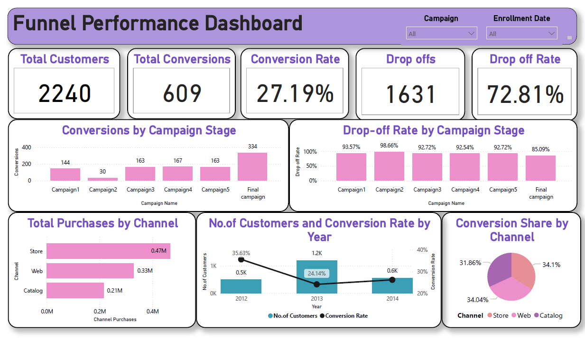
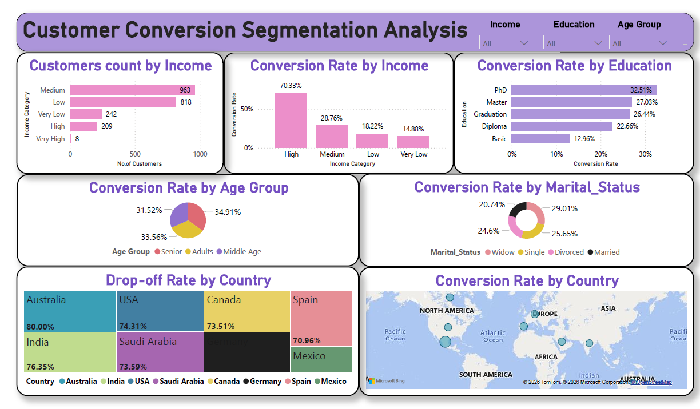
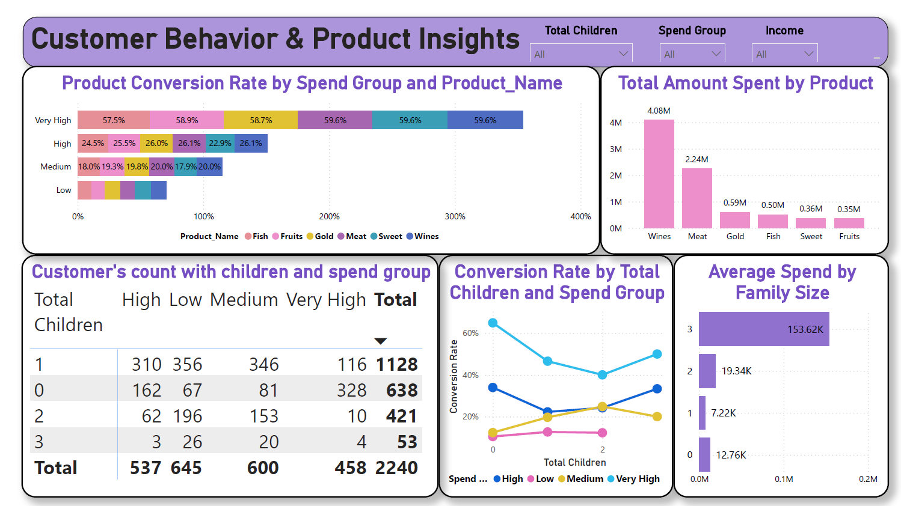
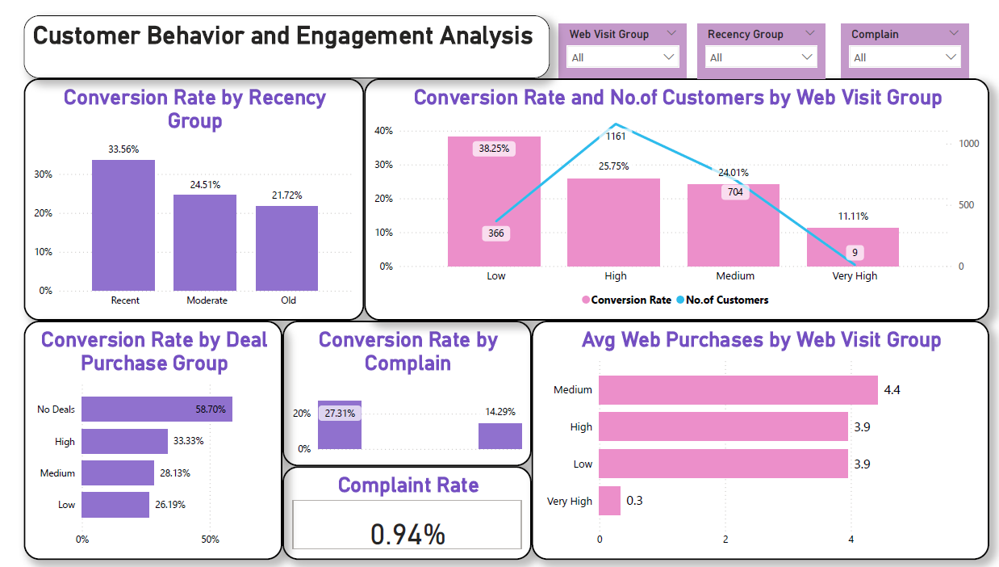

# 📊 Marketing Funnel & Conversion Performance Analysis

## 🚀 Project Summary

Analyzed customer journey data to identify drop-offs in the marketing funnel and provide actionable strategies to improve conversion rates using Excel and Power BI.

---

## 🔍 Project Overview

This project focuses on analyzing customer behavior across the marketing funnel — from initial website visits to final campaign conversion.

The goal is to:

* Identify where customers drop off
* Evaluate campaign effectiveness
* Understand factors influencing conversion
* Provide data-driven business recommendations

This analysis helps businesses improve targeting, engagement, and overall marketing performance. 

---

## 🎯 Problem Statement

Businesses often face:

* Lack of visibility into customer conversion funnel
* Difficulty identifying drop-off points
* Uncertainty in campaign performance
* Ineffective targeting strategies

This project solves these challenges using data-driven insights. 

---
## 📁 Project Structure

```
FUTURE_DS_03/
│
├── Dataset/
│   ├── Raw Data/
│   └── Cleaned Data/
│
├── Documentation/
│   └── Marketing Funnel & Conversion Performance Analysis.pdf
│
├── Power BI/
│   └── Marketing_Funnel_Analysis.pbix
│
├── Screenshots/
│   ├── Funnel_Performance_Analysis.png
│   ├── Customer_Conversion_Segmentation_Analysis.png
│   ├── Customer_Behavior_and_Products_Insights.png
│   └── Customer_Behavior_and_Engagement_Analysis.png
│
└── README.md
```


## 📂 Dataset Information

* Source: Maven Analytics (Marketing Campaign Dataset)
* Records: ~2200 customers
* Features: Customer demographics, spending, campaign response, and behavior

### Key Data Categories:

* Customer Information (Age, Income, Education, Marital Status)
* Purchase Behavior (Web, Store, Catalog)
* Campaign Interaction (Accepted Campaigns, Response)
* Engagement Metrics (Web visits, Recency)

---

## 🧹 Data Cleaning & Preprocessing (Excel)

* Handled missing values using median (Income column)

* Standardized inconsistent categories (e.g., marital status)

* Removed irrelevant or inconsistent data

* Created new features:

  * Total Children
  * Total Engagement
  * Income Category
  * Spend Group

* Converted raw dataset into structured format for analysis 

---

## 🔄 Data Transformation & Modeling

* Converted wide data into long format using Power Query (Unpivot)

* Created dimension tables:

  * Dim_Customer
  * Dim_Product
  * Dim_Campaign

* Built **Star Schema Model**:

  * Fact Table: `fact_marketing_data`
  * Relationships: One-to-Many

This improved data consistency and enabled efficient analysis. 

---

## 📊 Key Metrics (DAX Measures)

* Total Customers
* Conversions
* Conversion Rate
* Drop-off Count & Drop-off Rate
* Total Spend & Average Spend
* Channel-wise Conversions
* Product Conversion Rate

---

## 📈 Dashboard & Visualizations (Power BI)

The dashboard includes:

* Funnel Analysis (Visitors → Leads → Customers)
* Campaign Performance Analysis
* Channel-wise Purchase Analysis
* Customer Segmentation (Income, Age, Education)
* Geographic Analysis (Country-wise conversion)
* Behavioral Analysis (Recency, Web Visits, Complaints)

---

## 💡 Key Insights

### 🔻 Funnel Performance

* Conversion Rate: **27.19%**
* Drop-off Rate: **72.81%**
* High drop-offs observed in early funnel stages
* Final campaigns perform better than initial campaigns

### 💰 Customer Segmentation

* Medium & High-income customers convert more
* Higher education levels show better conversion
* Age and marital status have minimal impact

### 🌍 Geographic Insights

* Higher drop-offs in countries like India, USA, Australia
* Indicates need for region-specific strategies

### 🛍 Customer Behavior

* Recent customers have higher conversion rates
* Moderate web engagement leads to better conversion
* High website visits may indicate indecision
* Complaints significantly reduce conversion

### 📦 Product Insights

* Wines and Meat contribute highest revenue
* High-spending customers show better conversion

---

## 🎯 Business Recommendations

* Improve early-stage funnel engagement
* Target high-income and high-value customers
* Optimize campaigns for high drop-off regions
* Use personalized and repeated campaigns
* Improve customer experience to reduce complaints
* Apply strategic discounts for price-sensitive customers

---

## 🛠 Tools & Technologies

* Excel (Data Cleaning & Preprocessing)
* Power BI (Data Modeling & Visualization)
* Power Query (Transformation)
* DAX (Calculations)

---

## 📌 Final Conclusion

This project demonstrates how data-driven analysis can identify critical funnel drop-offs, understand customer behavior, and optimize marketing strategies to improve conversion rates and business performance. 

---

## 📷 Dashboard Screenshots

### 🔻 Funnel Performance Analysis


### 👥 Customer Conversion Segmentation


### 🛍 Customer Behavior & Product Insights


### 📊 Customer Behavior & Engagement


---

⭐ If you like this project, feel free to star the repository!

## 👤 Author

**Divya Thatha**

* Aspiring Data Analyst
* Skilled in Excel, Power BI, and Data Analysis
* 📫 Connect with me on LinkedIn: [(https://www.linkedin.com/in/divya-thatha/)](https://www.linkedin.com/in/divya-thatha/)

